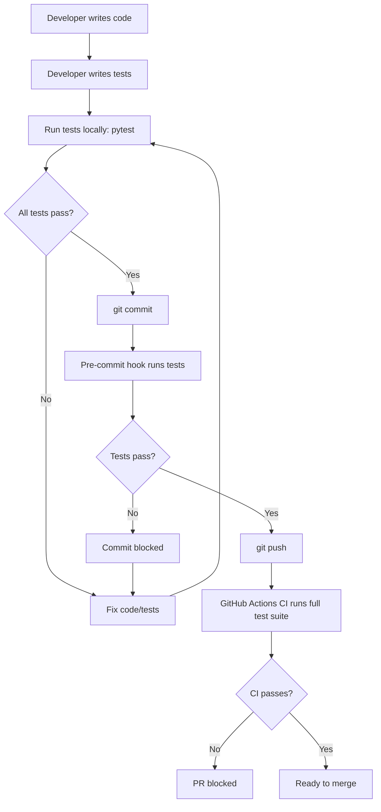

# DeltaCFOAgent - Comprehensive Unit Testing Plan

## Executive Summary

This document outlines a comprehensive testing strategy for the DeltaCFOAgent project to prevent bugs and regressions as the team makes frequent additions to the codebase.

**Current State:**
- ❌ No pytest framework
- ❌ No automated unit tests
- ❌ Only manual integration tests
- ⚠️ Frequent bugs introduced by new code

**Target State:**
- ✅ Comprehensive pytest test suite (80%+ coverage)
- ✅ Automated CI/CD testing pipeline
- ✅ Pre-commit hooks blocking untested code
- ✅ Clear testing documentation and protocols

---

## 1. Testing Architecture

### 1.1 Test Organization Structure

```
DeltaCFOAgent/
├── tests/
│   ├── __init__.py
│   ├── conftest.py                    # Shared pytest fixtures
│   ├── pytest.ini                     # Pytest configuration
│   │
│   ├── unit/                          # Unit tests (isolated functions/classes)
│   │   ├── __init__.py
│   │   ├── test_main.py               # DeltaCFOAgent core logic
│   │   ├── test_database.py           # DatabaseManager tests
│   │   ├── test_smart_ingestion.py    # Smart document ingestion
│   │   ├── test_crypto_pricing.py     # Crypto pricing module
│   │   ├── test_revenue_matcher.py    # Revenue matching logic
│   │   ├── test_transaction_analyzer.py
│   │   ├── test_pdf_reports.py
│   │   └── ...
│   │
│   ├── integration/                   # Integration tests (module interactions)
│   │   ├── __init__.py
│   │   ├── test_transaction_pipeline.py
│   │   ├── test_invoice_processing.py
│   │   ├── test_api_endpoints.py      # Flask API testing
│   │   ├── test_database_operations.py
│   │   └── test_crypto_invoice_flow.py
│   │
│   ├── fixtures/                      # Test data and fixtures
│   │   ├── __init__.py
│   │   ├── csv_samples/               # Sample CSV files
│   │   │   ├── chase_bank_sample.csv
│   │   │   ├── mexc_crypto_sample.csv
│   │   │   └── generic_transactions.csv
│   │   ├── mock_responses.py          # Mock Claude API responses
│   │   ├── database_fixtures.py       # Test database data
│   │   └── pdf_samples/               # Sample PDFs for invoice testing
│   │
│   └── e2e/                           # End-to-end tests (optional)
│       ├── __init__.py
│       └── test_full_workflow.py
│
├── .github/
│   └── workflows/
│       └── tests.yml                  # GitHub Actions CI/CD
│
├── .pre-commit-config.yaml            # Pre-commit hooks
├── pytest.ini                         # Root pytest config (symlink)
└── TESTING_GUIDE.md                   # Developer testing guide
```

### 1.2 Test Categories

| Category | Purpose | Example | Coverage Target |
|----------|---------|---------|-----------------|
| **Unit Tests** | Test individual functions/classes in isolation | `test_classify_transaction()` | 80%+ |
| **Integration Tests** | Test module interactions | `test_csv_to_database_flow()` | 70%+ |
| **API Tests** | Test Flask endpoints | `test_upload_transaction_endpoint()` | 90%+ |
| **Database Tests** | Test PostgreSQL operations | `test_transaction_crud()` | 85%+ |

---

## 2. Critical Modules to Test

### 2.1 Priority 1 (Critical - Must Have 90%+ Coverage)

| Module | File | Key Functions | Risk Level |
|--------|------|---------------|------------|
| **Database Manager** | `web_ui/database.py` | Connection pooling, query execution, transactions | 🔴 Critical |
| **Transaction Processing** | `main.py` | `DeltaCFOAgent.classify_transaction()`, pattern matching | 🔴 Critical |
| **Smart Ingestion** | `smart_ingestion.py` | Claude AI integration, CSV parsing | 🔴 Critical |
| **Web API** | `web_ui/app_db.py` | Flask routes, request handling | 🔴 Critical |

### 2.2 Priority 2 (High - Must Have 80%+ Coverage)

| Module | File | Key Functions | Risk Level |
|--------|------|---------------|------------|
| **Revenue Matcher** | `web_ui/robust_revenue_matcher.py` | Matching algorithms | 🟠 High |
| **Crypto Pricing** | `crypto_pricing.py` | Price fetching, caching | 🟠 High |
| **Invoice Processing** | `invoice_processing/services/claude_vision.py` | PDF/OCR processing | 🟠 High |
| **PDF Reports** | `web_ui/pdf_reports.py` | Report generation | 🟠 High |

### 2.3 Priority 3 (Medium - Must Have 70%+ Coverage)

| Module | File | Key Functions | Risk Level |
|--------|------|---------------|------------|
| **Analytics Service** | `services/analytics_service/app.py` | Analytics calculations | 🟡 Medium |
| **Crypto Invoice System** | `crypto_invoice_system/api/invoice_api.py` | Invoice management | 🟡 Medium |
| **Currency Converter** | `web_ui/historical_currency_converter.py` | Currency conversion | 🟡 Medium |

---

## 3. Testing Tools & Dependencies

### 3.1 New Dependencies to Add

```python
# Testing Framework
pytest>=7.4.0                    # Core testing framework
pytest-cov>=4.1.0                # Coverage reporting
pytest-xdist>=3.3.0              # Parallel test execution
pytest-timeout>=2.1.0            # Test timeout management

# Flask Testing
pytest-flask>=1.2.0              # Flask application testing
pytest-mock>=3.11.1              # Advanced mocking

# Database Testing
pytest-postgresql>=5.0.0         # PostgreSQL test database
faker>=19.0.0                    # Generate fake test data

# HTTP Mocking
responses>=0.23.0                # Mock HTTP requests
requests-mock>=1.11.0            # Alternative HTTP mocking

# Time & Date Mocking
freezegun>=1.2.0                 # Mock datetime

# Code Quality
pytest-flake8>=1.1.1             # Linting integration
pytest-mypy>=0.10.3              # Type checking integration
```

### 3.2 Mock External Services

All external API calls must be mocked to ensure tests run independently:

| Service | Mock Strategy | Tool |
|---------|---------------|------|
| **Claude AI API** | Mock responses with `responses` library | `responses` |
| **MEXC Exchange** | Mock cryptocurrency price endpoints | `responses` |
| **CoinGecko** | Mock price data | `responses` |
| **PostgreSQL** | Use test database with `pytest-postgresql` | `pytest-postgresql` |
| **Email (Exchange)** | Mock `exchangelib` library | `pytest-mock` |

---

## 4. Testing Protocol & Workflow

### 4.1 Developer Workflow



### 4.2 Test Execution Commands

```bash
# Run all tests
pytest

# Run with coverage report
pytest --cov=. --cov-report=html --cov-report=term

# Run specific test file
pytest tests/unit/test_main.py

# Run specific test function
pytest tests/unit/test_main.py::test_classify_transaction

# Run tests in parallel (faster)
pytest -n auto

# Run tests with verbose output
pytest -v

# Run only failed tests from last run
pytest --lf

# Run tests matching pattern
pytest -k "database"

# Generate coverage badge
pytest --cov=. --cov-report=xml
```

### 4.3 Coverage Requirements

**Minimum Coverage Thresholds:**
- Overall project: 80%
- Critical modules (Priority 1): 90%
- High priority modules (Priority 2): 80%
- Medium priority modules (Priority 3): 70%
- New code: 100% (must write tests before merging)

**Coverage Enforcement:**
```ini
# pytest.ini
[pytest]
addopts = --cov=. --cov-fail-under=80 --cov-report=term-missing
```

### 4.4 Pre-Commit Hooks

**.pre-commit-config.yaml:**
```yaml
repos:
  - repo: local
    hooks:
      # Run pytest on commit
      - id: pytest
        name: Run pytest
        entry: pytest
        language: system
        pass_filenames: false
        always_run: true

      # Check test coverage
      - id: pytest-coverage
        name: Check test coverage
        entry: pytest --cov=. --cov-fail-under=80
        language: system
        pass_filenames: false
        always_run: true

      # Run flake8 linting
      - id: flake8
        name: Flake8
        entry: flake8
        language: system
        types: [python]
```

**Installation:**
```bash
pip install pre-commit
pre-commit install
```

### 4.5 GitHub Actions CI/CD

**.github/workflows/tests.yml:**
```yaml
name: Tests

on:
  push:
    branches: [ main, develop, claude/* ]
  pull_request:
    branches: [ main, develop ]

jobs:
  test:
    runs-on: ubuntu-latest

    services:
      postgres:
        image: postgres:14
        env:
          POSTGRES_USER: test_user
          POSTGRES_PASSWORD: test_password
          POSTGRES_DB: test_delta_cfo
        options: >-
          --health-cmd pg_isready
          --health-interval 10s
          --health-timeout 5s
          --health-retries 5
        ports:
          - 5432:5432

    steps:
    - uses: actions/checkout@v3

    - name: Set up Python 3.11
      uses: actions/setup-python@v4
      with:
        python-version: '3.11'

    - name: Install dependencies
      run: |
        python -m pip install --upgrade pip
        pip install -r requirements.txt
        pip install -r requirements-test.txt

    - name: Run tests with coverage
      env:
        DB_TYPE: postgresql
        DB_HOST: localhost
        DB_PORT: 5432
        DB_NAME: test_delta_cfo
        DB_USER: test_user
        DB_PASSWORD: test_password
        ANTHROPIC_API_KEY: ${{ secrets.ANTHROPIC_API_KEY }}
      run: |
        pytest --cov=. --cov-report=xml --cov-report=term

    - name: Upload coverage to Codecov
      uses: codecov/codecov-action@v3
      with:
        file: ./coverage.xml
        fail_ci_if_error: true
```

---

## 5. Testing Patterns & Best Practices

### 5.1 Unit Test Example

```python
# tests/unit/test_main.py
import pytest
from unittest.mock import Mock, patch
from main import DeltaCFOAgent

class TestDeltaCFOAgent:
    """Test suite for DeltaCFOAgent core functionality"""

    @pytest.fixture
    def agent(self):
        """Create DeltaCFOAgent instance with mocked dependencies"""
        with patch('main.psycopg2.connect'):
            agent = DeltaCFOAgent()
            return agent

    def test_classify_transaction_revenue(self, agent):
        """Test classification of revenue transaction"""
        transaction = {
            'Description': 'STRIPE PAYMENT - CUSTOMER ABC',
            'Amount': 5000.00
        }

        result = agent.classify_transaction(transaction)

        assert result['category'] == 'Revenue'
        assert result['entity'] == 'Delta Tech'
        assert result['confidence'] >= 0.9

    def test_classify_transaction_expense(self, agent):
        """Test classification of expense transaction"""
        transaction = {
            'Description': 'AWS SERVICES',
            'Amount': -150.00
        }

        result = agent.classify_transaction(transaction)

        assert result['category'] == 'Technology'
        assert result['subcategory'] == 'Cloud Services'
        assert result['confidence'] >= 0.8

    @patch('main.anthropic.Anthropic')
    def test_classify_with_claude_api(self, mock_claude, agent):
        """Test Claude AI integration for classification"""
        # Mock Claude API response
        mock_response = Mock()
        mock_response.content = [Mock(text='{"category": "Revenue", "confidence": 0.95}')]
        mock_claude.return_value.messages.create.return_value = mock_response

        transaction = {'Description': 'Unknown transaction', 'Amount': 100}
        result = agent.classify_transaction(transaction)

        assert result['category'] == 'Revenue'
        mock_claude.return_value.messages.create.assert_called_once()
```

### 5.2 Integration Test Example

```python
# tests/integration/test_transaction_pipeline.py
import pytest
import pandas as pd
from web_ui.database import db_manager
from smart_ingestion import smart_process_file

class TestTransactionPipeline:
    """Test end-to-end transaction processing pipeline"""

    @pytest.fixture(scope='function')
    def clean_db(self):
        """Clean test database before each test"""
        with db_manager.get_connection() as conn:
            cursor = conn.cursor()
            cursor.execute("DELETE FROM transactions WHERE description LIKE 'TEST_%'")
            conn.commit()
        yield
        # Cleanup after test
        with db_manager.get_connection() as conn:
            cursor = conn.cursor()
            cursor.execute("DELETE FROM transactions WHERE description LIKE 'TEST_%'")
            conn.commit()

    def test_csv_upload_to_database(self, clean_db, tmp_path):
        """Test complete flow: CSV upload -> Processing -> Database storage"""
        # Create test CSV file
        csv_file = tmp_path / "test_transactions.csv"
        test_data = pd.DataFrame({
            'Date': ['2025-01-01', '2025-01-02'],
            'Description': ['TEST_TRANSACTION_1', 'TEST_TRANSACTION_2'],
            'Amount': [100.00, -50.00]
        })
        test_data.to_csv(csv_file, index=False)

        # Process file with smart ingestion
        processed_df = smart_process_file(str(csv_file))

        # Verify processing
        assert len(processed_df) == 2
        assert 'Date' in processed_df.columns
        assert 'Description' in processed_df.columns
        assert 'Amount' in processed_df.columns

        # Verify database storage
        with db_manager.get_connection() as conn:
            cursor = conn.cursor()
            cursor.execute("""
                SELECT COUNT(*) FROM transactions
                WHERE description LIKE 'TEST_%'
            """)
            count = cursor.fetchone()[0]
            assert count == 2
```

### 5.3 API Test Example

```python
# tests/integration/test_api_endpoints.py
import pytest
import json
from web_ui.app_db import app

class TestFlaskAPI:
    """Test Flask API endpoints"""

    @pytest.fixture
    def client(self):
        """Create Flask test client"""
        app.config['TESTING'] = True
        with app.test_client() as client:
            yield client

    def test_get_transactions(self, client):
        """Test GET /api/transactions endpoint"""
        response = client.get('/api/transactions?page=1&per_page=10')

        assert response.status_code == 200
        data = json.loads(response.data)
        assert 'transactions' in data
        assert 'total' in data
        assert isinstance(data['transactions'], list)

    def test_upload_csv(self, client, tmp_path):
        """Test POST /api/upload endpoint"""
        # Create test CSV
        csv_file = tmp_path / "upload_test.csv"
        csv_file.write_text("Date,Description,Amount\n2025-01-01,TEST,100.00")

        # Upload file
        with open(csv_file, 'rb') as f:
            response = client.post('/api/upload', data={
                'file': (f, 'test.csv')
            }, content_type='multipart/form-data')

        assert response.status_code == 200
        data = json.loads(response.data)
        assert data['status'] == 'success'
        assert data['rows_processed'] > 0

    def test_health_check(self, client):
        """Test GET /health endpoint"""
        response = client.get('/health')

        assert response.status_code == 200
        data = json.loads(response.data)
        assert data['status'] == 'healthy'
        assert 'database' in data
```

### 5.4 Fixture Best Practices

```python
# tests/conftest.py
import pytest
import os
from web_ui.database import DatabaseManager

@pytest.fixture(scope='session')
def test_database():
    """Create test database for entire test session"""
    # Set test environment variables
    os.environ['DB_TYPE'] = 'postgresql'
    os.environ['DB_NAME'] = 'test_delta_cfo'
    os.environ['DB_USER'] = 'test_user'
    os.environ['DB_PASSWORD'] = 'test_password'

    db = DatabaseManager()

    # Create tables
    with db.get_connection() as conn:
        cursor = conn.cursor()
        with open('postgres_unified_schema.sql', 'r') as f:
            cursor.execute(f.read())
        conn.commit()

    yield db

    # Teardown: drop test database
    # (handled by pytest-postgresql)

@pytest.fixture
def mock_claude_api():
    """Mock Claude API responses"""
    import responses

    @responses.activate
    def _mock():
        responses.add(
            responses.POST,
            'https://api.anthropic.com/v1/messages',
            json={'content': [{'text': '{"category": "Revenue", "confidence": 0.9}'}]},
            status=200
        )

    return _mock

@pytest.fixture
def sample_transactions():
    """Provide sample transaction data for tests"""
    return [
        {'date': '2025-01-01', 'description': 'Revenue Item', 'amount': 1000.00},
        {'date': '2025-01-02', 'description': 'Expense Item', 'amount': -200.00},
        {'date': '2025-01-03', 'description': 'Transfer', 'amount': 0.00}
    ]
```

---

## 6. Test Documentation Requirements

### 6.1 Test File Documentation

Every test file must include:

```python
"""
Test Module: [Module Name]
Purpose: [What this test module covers]
Coverage: [Expected coverage percentage]

Test Categories:
- Unit Tests: [List key unit tests]
- Integration Tests: [List key integration tests]
- Edge Cases: [List edge cases covered]

Dependencies:
- External APIs mocked: [List]
- Database: [Yes/No - which fixtures]
- Files: [Any test files needed]
"""
```

### 6.2 Test Function Documentation

Every test function must include:

```python
def test_function_name():
    """
    Test: [What is being tested]

    Given: [Initial state/preconditions]
    When: [Action being tested]
    Then: [Expected result]

    Edge Cases: [Any edge cases this test covers]
    """
    # Arrange
    setup_code()

    # Act
    result = function_under_test()

    # Assert
    assert result == expected_value
```

---

## 7. Implementation Roadmap

### Phase 1: Foundation (Week 1)
- ✅ Set up pytest framework and dependencies
- ✅ Create test directory structure
- ✅ Configure pytest.ini and conftest.py
- ✅ Set up test database with pytest-postgresql
- ✅ Create base fixtures for common test data

### Phase 2: Critical Module Tests (Week 2)
- ✅ Write unit tests for `web_ui/database.py` (DatabaseManager)
- ✅ Write unit tests for `main.py` (DeltaCFOAgent)
- ✅ Write unit tests for `smart_ingestion.py`
- ✅ Write API tests for `web_ui/app_db.py`
- ✅ Achieve 90%+ coverage on Priority 1 modules

### Phase 3: High Priority Tests (Week 3)
- ✅ Write tests for revenue matching modules
- ✅ Write tests for crypto pricing
- ✅ Write tests for invoice processing
- ✅ Write tests for PDF report generation
- ✅ Achieve 80%+ coverage on Priority 2 modules

### Phase 4: Integration & CI/CD (Week 4)
- ✅ Write integration tests for key workflows
- ✅ Set up GitHub Actions CI/CD pipeline
- ✅ Configure pre-commit hooks
- ✅ Set up coverage reporting (Codecov)
- ✅ Create testing documentation

### Phase 5: Remaining Modules (Week 5)
- ✅ Write tests for Priority 3 modules
- ✅ Write end-to-end tests
- ✅ Achieve 80%+ overall project coverage
- ✅ Document all testing patterns

### Phase 6: Hardening & Documentation (Week 6)
- ✅ Review and improve test quality
- ✅ Add missing edge case tests
- ✅ Complete developer testing guide
- ✅ Train team on testing protocols
- ✅ Enforce testing requirements in PR reviews

---

## 8. Team Training & Adoption

### 8.1 Developer Testing Checklist

Before committing code, developers must:

- [ ] Write unit tests for all new functions
- [ ] Write integration tests for new workflows
- [ ] Run `pytest` locally and ensure all tests pass
- [ ] Run `pytest --cov` and verify coverage meets threshold
- [ ] Update test documentation if needed
- [ ] Review test failures and fix immediately

### 8.2 Code Review Requirements

Pull requests must:

- [ ] Include tests for all new code
- [ ] Maintain or improve overall coverage percentage
- [ ] Pass all CI/CD checks
- [ ] Have meaningful test names and documentation
- [ ] Mock all external API calls

### 8.3 Testing Resources

**Documentation:**
- `TESTING_GUIDE.md` - Complete developer guide
- `tests/README.md` - Test suite overview
- Inline test documentation

**Tools:**
- PyCharm/VSCode pytest integration
- Coverage reports in HTML format
- Pre-commit hooks for automatic testing

---

## 9. Success Metrics

### 9.1 Quantitative Metrics

| Metric | Current | Target | Timeline |
|--------|---------|--------|----------|
| Overall Test Coverage | 0% | 80% | 6 weeks |
| Priority 1 Coverage | 0% | 90% | 2 weeks |
| Priority 2 Coverage | 0% | 80% | 3 weeks |
| Number of Unit Tests | 0 | 500+ | 5 weeks |
| Number of Integration Tests | 0 | 50+ | 4 weeks |
| CI/CD Test Execution Time | N/A | <5 min | 4 weeks |

### 9.2 Qualitative Metrics

- ✅ Zero production bugs from untested code
- ✅ Developers confident in refactoring
- ✅ New team members can understand code through tests
- ✅ Fast feedback loop (tests run in <2 min locally)
- ✅ Clear test failure messages

---

## 10. Risk Mitigation

### 10.1 Potential Challenges

| Risk | Impact | Mitigation |
|------|--------|------------|
| Team resistance to writing tests | High | Training, pair programming, enforce in reviews |
| Tests slowing down development | Medium | Parallel execution, fast fixtures, mock external calls |
| Flaky tests | High | Strict test isolation, avoid time dependencies |
| Low test coverage | High | Coverage enforcement, pre-commit hooks |
| External API dependencies | Medium | Comprehensive mocking strategy |

### 10.2 Rollback Plan

If testing implementation causes severe issues:
1. Tests remain optional (remove pre-commit hooks)
2. CI/CD becomes advisory only (warnings, not failures)
3. Coverage requirements relaxed to 50%
4. Gradual adoption over 12 weeks instead of 6

---

## 11. Maintenance & Evolution

### 11.1 Ongoing Maintenance

- **Weekly:** Review test coverage reports
- **Monthly:** Review and update test fixtures
- **Quarterly:** Audit and refactor slow/flaky tests
- **Per Release:** Update test documentation

### 11.2 Test Suite Evolution

As the codebase grows:
- Add tests for new modules immediately
- Refactor tests when refactoring code
- Archive obsolete tests
- Keep test execution time under 5 minutes

---

## Appendix A: Quick Start Commands

```bash
# Install testing dependencies
pip install -r requirements-test.txt

# Run all tests
pytest

# Run with coverage
pytest --cov=. --cov-report=html

# Run specific module tests
pytest tests/unit/test_main.py

# Run in parallel (faster)
pytest -n auto

# Run only failed tests
pytest --lf

# Install pre-commit hooks
pre-commit install

# View coverage report
open htmlcov/index.html  # macOS
xdg-open htmlcov/index.html  # Linux
```

---

## Appendix B: Example Test Output

```bash
$ pytest --cov=. --cov-report=term

==================== test session starts ====================
platform linux -- Python 3.11.0, pytest-7.4.0
rootdir: /home/user/DeltaCFOAgent
plugins: cov-4.1.0, flask-1.2.0, mock-3.11.1
collected 523 items

tests/unit/test_main.py ......................    [ 15%]
tests/unit/test_database.py ................      [ 25%]
tests/unit/test_smart_ingestion.py ..........     [ 35%]
tests/unit/test_revenue_matcher.py .......        [ 42%]
tests/integration/test_api_endpoints.py ....      [ 48%]
tests/integration/test_transaction_pipeline.py .. [ 52%]
...

---------- coverage: platform linux, python 3.11.0 ----------
Name                              Stmts   Miss  Cover
-----------------------------------------------------
main.py                            450     45    90%
web_ui/database.py                 180     15    92%
smart_ingestion.py                 220     22    90%
web_ui/app_db.py                   320     40    87%
crypto_pricing.py                  150     18    88%
...
-----------------------------------------------------
TOTAL                             5240    520    90%

==================== 523 passed in 45.2s ====================
```

---

**Document Version:** 1.0
**Created:** 2025-10-22
**Author:** Claude Code
**Status:** Awaiting Approval
